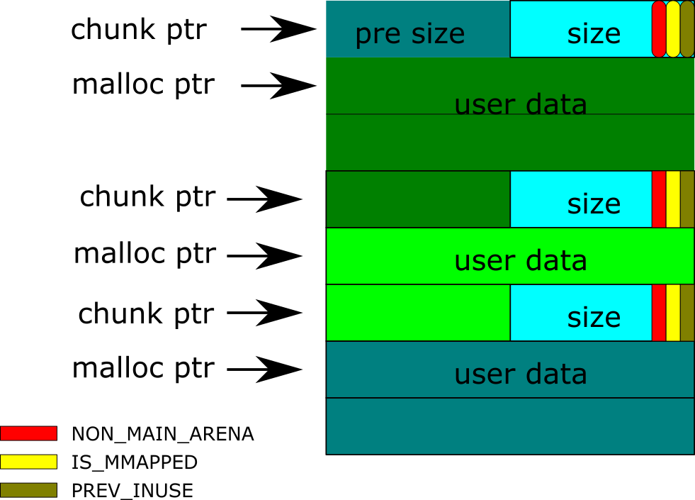
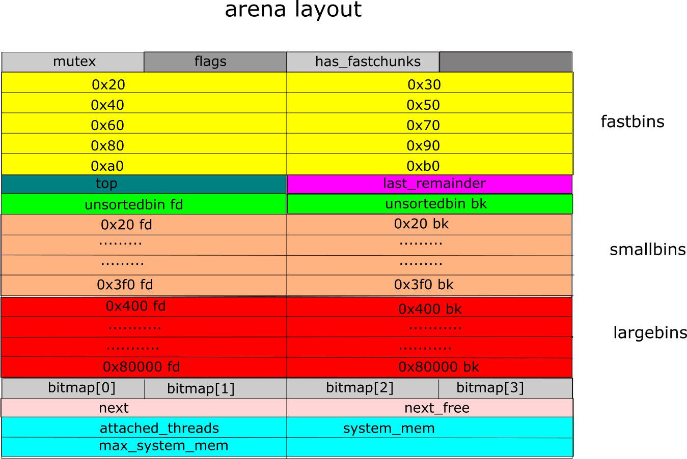

## GNU libc 下堆利用总结(x86)

### 导论

**堆 (heap)**是虚拟内存上连续的内存块，其处于低地址端，从小地址向大地址增长，这些内存块可以在程序运行时按需动态分配（ 大小不定，程序运行时无法预知需要多少内存), 这个特点，和栈 (stack)相比, 使得内存分配和回收要十分谨慎，既要高速，也要减少内存块的碎片化。

针对这些问题，需要设计不同的算法和机制进行专门管理，其具体表现就是 libc 的`malloc`和`free`的实现方式。

因此，对于不同的操作系统，其背后的实现算法有可能不同。(即 libc 不同，注意libc不属于内核部分，但malloc依赖内核里某些基础函数，如若在Linux内核下的`mmap`或`brk`) 

本文探讨的是GNU 的 libc 的演进迭代历史，以及各个版本的漏洞和利用方式。GNU libc（glibc）广泛应用在各种 Linux的发行版本，有很高的研究价值。

### GNU libc 的 malloc 原理和行为

#### malloc_chunks

调用libc的`malloc`申请一块内存，如不出意外，它会返回一个指针(这里用malloc ptr表示)，但对于内存管理器来说，由于其需要对内存进行管理，需要对分配的内存进行加头储存必要信息，所以每次调用malloc，内存管理器获取的地址是malloc ptr的值后退16字节的地址，这个地址开始的内存块除了包含用户申请的内存块，还包含内存块的元信息(前8个字节表示前一个malloc_chunk的大小，后8个字节表示当前malloc_chunk的大小) 如下图所示：

关于malloc_chunk的说明：

1. 图中的size是指单前chunk的大小，数值等于user_data的大小 + size这个块的大小（即8字节），但是从源码看malloc_chunk这个结构体，它是包含pre_size那一块的，但为何不需把它加入size里？这里要引入size里的最后三位的用途

2. size的最后三位分别是：NON_MAIN_ARENA、IS_MMAPED和PRE_INUSE。这里先解析PRE_INUSE的用途。当PRE_INUSE是1时，表示前面一个chunk还没有被用户释放，为0时则相反。后面在unlink时会利用这位的信息决定否和前面一个chunk合并，减少碎片化。

   现在设想这样一个场景，某个chunk B，它的size里的PRE_INUSE是1，那么size块前面的8字节的块本来是表示前面那一个chunk A的大小的，但是由于PRE_INUSE=1，用户没有释放A。对于管理器而言，pre_size这个信息没有意义，所以那8字节的块可以被用户信息覆盖，只要用户释放的时候，从新写回来就可以了。也就是说，user_data和pre_size可以overlap。

3. 以字节为单位，malloc_chunk的最小大小为32，即0x20。malloc_chunk以16字节大小递增，如比0x20大小的chunk大的chunk中，最小的chunk应该是0x30，不存在它们之间的。这样做既是为了对齐，也是为了储存某些free_chunk的元数据，比如后面会讲到的双向指针。而且，由2知道，后三位是不算入size里的，如在内存里读到那个地方是0x21, chunk的大小应该是0x20.

4. 根据上面一点，malloc_chunk的大小应该是0x20、0x30、0x40、等等，对应的user_data大小应该是0x18、0x28、0x38等等，但是，由于malloc是在程序runtime调用的函数，其大小由用户决定，因此如果调用malloc(0x17), 底层的malloc_chunk大小是0x20, 但调用malloc(0x19), 其对应的malloc_chunk大小应该是0x30。这样会导致内存浪费，但从内存对齐以及减少碎片化的角度看，是一个折中的方案。

#### Arena

用户调用malloc会在堆(heap)里动态划分内存，为了减少碎片化和提高查询速度，会引入诸如单向链表、双向链表等数据结构，这些结构的元数据(如单向链表的头)，不能完全放在堆上(动态变化，不稳定)。从源码上看，堆初始化需要初始一个叫main_arena的结构体，显然这个结构体的是在盏(stack)上的，而这个结构体存放的就是堆的那些被释放的内存的元数据。形象点说，main_arena就是heap的一个账本。之所以叫main_arena, 是因为其为主线程的arena，对于多线程的程序，各自线程里也有自己的arena，这些arena之间组成一个单向链表。线程的arena留到tcache再讲，下面主要讨论main_arena :

- **mutex**: 互斥锁，读写的时候自动加锁，多线程情况下会有性能问题，进而后面引入了tcache
- **flags**: 包含对应的heap 是否为连续的内存块
- **has_fastchunks**: fastbin是否为空的标记(boolean值，double word), 这个区域以及后面的4个字节是在glibc v2.27引入，之前的版本，这个字段是合在flags里。
- **fastbins**：对于那些大小在0x20到0xb0的malloc_chunk, 统一称为fastbin，用户释放这些chunk的时候，它们不会参与前面的chunk合并，而是按照大小组织起来，相同大小的chunk放在同一个单向链表里，FIFO，链表头存放在arena fastbins的对应位置。
- **top**: 位置最高的那个chunk的位置(指针)，其实这个chunk就是heap的空余大小，当需要划分新的内存块时，会首先重这里切割。
- **last_remainder**: 略(具体可参考下面的house of orange 里的unsorted bins attack)
- **unsortedbin**：这些bin不限制大小，组成一个双向的环状链表，通过arena的fd 和 bk链接起来，即unsortedbin fd 指向第一个chunk，unsortedbin bk指向
- **smallbins**: 类似unsortedbin, 但大小要区分，与fasbin大小有部分重合，FIFO
- **largebins**: 类似unsortedbin，大小不限。

### GUN libc演变和利用技巧

#### [House of force](house_of_force/house_of_force.md) 

通过溢出改写top chunk 头信息，利用整数溢出达到任意写

#### [Fastbins dup](fastbin_dup/fastbin_dup.md)

利用double free漏洞，改写fastbin单向链表，实现任意写

#### Unsafe-unlink

[todo]

最初版的DL malloc，改写unsortedbin 的fd 和bk，达到一个双向的写。

#### Safe-unlink

[todo]

针对上述问题，libc增加了校验，但通过构造假chunk，依旧可以绕过。

#### XOR-safe-unlink

[todo]

libc 2.31增加了安全校验，chunk的地址不会直接储存在heap上，而是拿它所在的地址和它本身xor，结合地址本身的ASLR机制，这实质上是对地址进行了加密. 所有依赖ASLR的绕过，最直接有效都是需要某种地址泄漏。

#### House of Sprit

[todo]

#### House of Lore

[todo]

#### House of Rabbit

[todo]

#### House of Orange

[todo]

### glibc与堆相关的术语

- **DL malloc**
- **pt malloc**
- **Chunks**
- **Arena**
- **malloc_chunk**

 

### 结论

### 参考文献